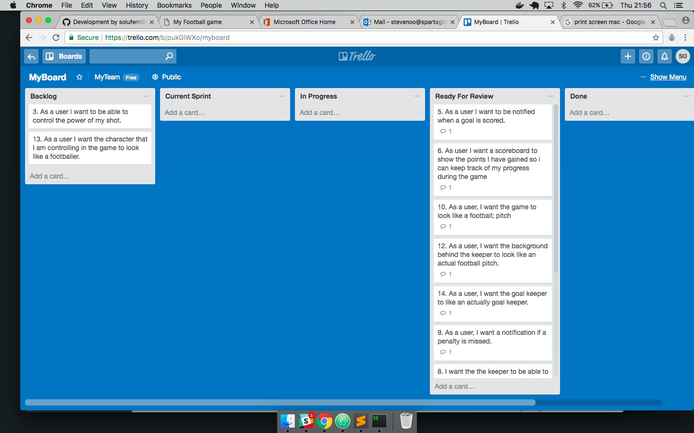
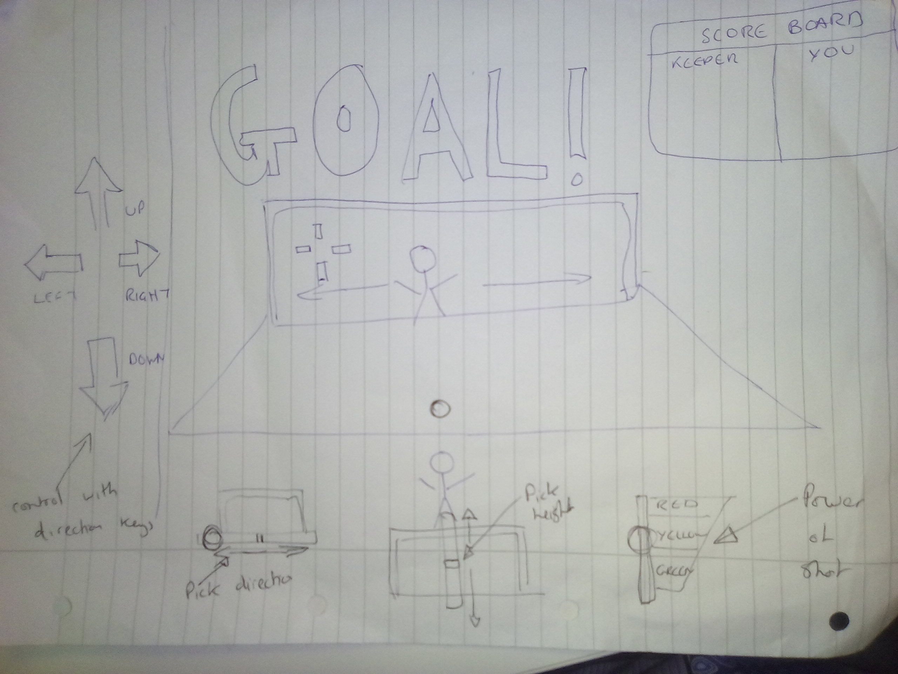

# sparta-project1-jsgame

## What is your game?

My game is a penalty shootout game against the computer as the goalkeeper. Each goal scored earns the player a point, whilst each one missed results in the keeper gaining a point.

## Instructions on how to play the game.

The first page the user comes across is the welcome page with brief instructions on how to play the game. There is a 'Start game' button you must click to start the actual game. This takes you to a new page where the game is located.

Using the crosshair pointer, you must click an area of the goal that you would like the shot to be placed. The instant the click is made, the ball will travel towards the goal. If the keeper manages to get in the way of the shot, its a save. The first person to get to 10 points wins the game.

## My task

Your mission, should you choose to accept it! Is to build a **browser based game!** Your game should be built using html, css and JavaScript!

**The choice of game is totally up to you however before you get to work, you must ensure you have had your project idea approved by one of your trainers.**

Your game must:

* Include an instruction section explaining how to play the game.
* Ether display a message when the user has won or display the users score after the game has finished.
* Be styled to perfection!
* Be hosted online!

## Completed user stories

* As a user, there should be a notification when a goal is scored
* As a user, I want a scoreboard to show the points I have gained so I can keep track of my progress during the game.
* As a user, I want the game to look like a football pitch
* As a user, I want the background behind the keeper to look like an actual football pitch.
* As a user, I was the goalkeeper to look like a real goalkeeper
* As a user, I would like a notification when a penalty is missed.
* As a user I want to control the direction of my shot so I can influence how effective at the game I am
* As a user I would like to be able to influence the height of my shot.
* As a user, I would like to see the keeper react and try and save my shot.

## Planning

## The most challenging part

One of the things I struggled with was creating a program that would register when the keeper came in contact with the ball. I also struggled at first to implement variation on the shots. I also had difficulty customising the cursor to an image of my choice. I would have liked a bigger crosshair.

## What I was most pleased with

I really like the animations I have used in relation to movement of the keeper and the ball. I am also happy with how managed to record when the keeper came in contact with the ball.
